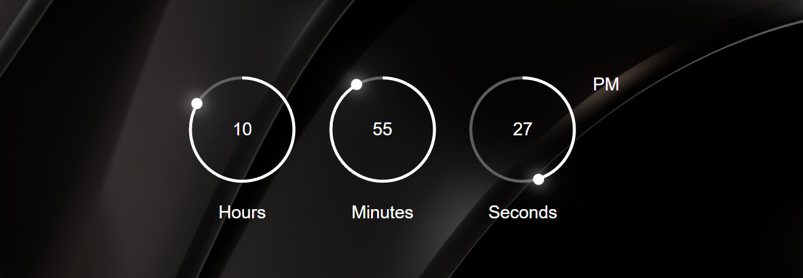

#### Custom Google Search Page


#### Clock Js


#### Form Validation 


#### Form validation with Php and MySQL database
<i>Note: Change the table_name to your own table in MySQL database</i>
```bash
<!-- home.php -->
$select_query = "SELECT * FROM ==table_name== WHERE name = :username AND password = :password";
```
```bash
<!-- signup.php -->
$insert_query = "INSERT INTO ==table_name==(name, password, address) VALUES (:username, :password, :address)";
```

#### Ajax Search 


```bash
<!-- server.php -->
$select_query = "SELECT username, address, contact FROM table_name WHERE username LIKE '%".$_GET['search']."%'";
```